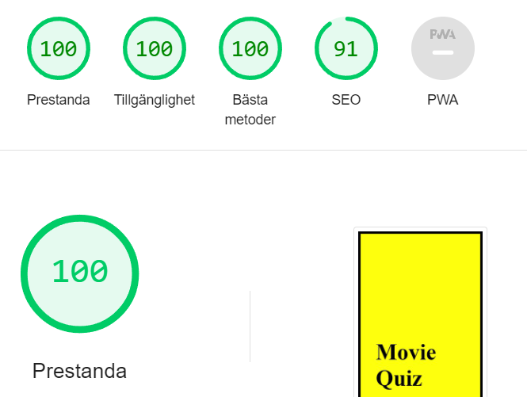

# Movie Quiz
this quiz is for the person that loves to watch movies and can identify the movies quotes.
The purpose of this quiz is to see if you can get all correct answers and have fun.

## progress
1. 
2. 
3. 
4. 

## Validator Testing
1. 
2. 
3. 
4. 

## Improvement
if i had more time this is what i would like to implemented to my quiz.
1. I can add a scoring system to count how many correct and incorrect answers was made.
2. I can but a timer so that the player have a shorter time to search up the correct information.
3. I can add so that when i answer the questions wrong its ends.

## credits
i got need to give credit to this youtube that i could build this quiz.
1. 
took his idé for getting stated with my javascript especially with the const. 
2. 
took his idé for getting improve with my javascript function. 
thanks to them i could get a ide to build me quiz.

### bugs 
i could not get my quiz started because my function could not read my id that i forgot to type in but after i put in the correct id name then my quiz could start.

## deployment
i have deployed to my GitHub page 
you can find my Live link hear 